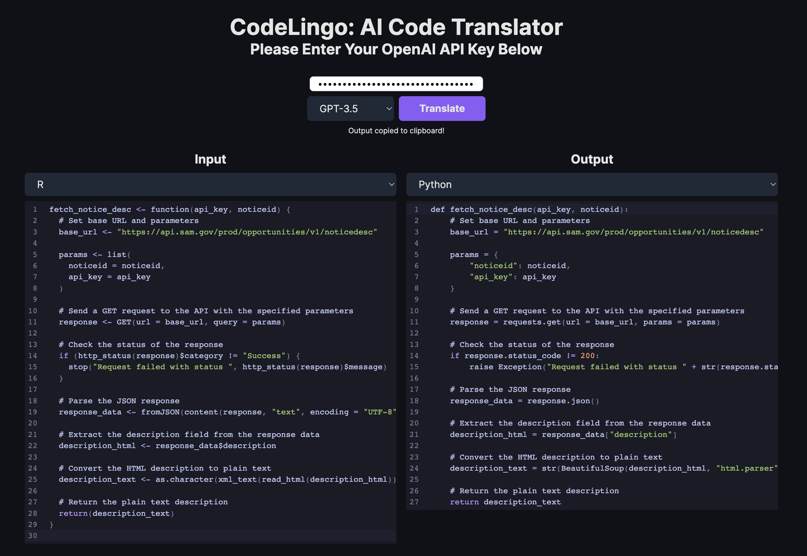

# CodeLingo

An AI-powered code translator using GPT-4 to convert between programming languages.




## Running Locally

**1. Clone Repo**

```bash
git clone https://github.com/aousabdo/codelingo
```

**2. Install Dependencies**

```bash
npm i
```

**3. Run App**

```bash
npm run dev
```

